# Autumn Photo - Event Photography Management Platform

A comprehensive web application for managing event photography with AI-powered photo tagging, real-time notifications, and role-based access control.

## 📋 Table of Contents

- [Overview](#overview)
- [App Flow & Features](#app-flow--features)
- [Technology Stack](#technology-stack)
- [Architecture](#architecture)
- [Prerequisites](#prerequisites)
- [Installation & Setup](#installation--setup)
- [Running the Application](#running-the-application)
- [Project Structure](#project-structure)
- [API Endpoints](#api-endpoints)
- [Feature Implementation Details](#feature-implementation-details)
- [User Roles & Permissions](#user-roles--permissions)
- [Contributing](#contributing)

---

## 🎯 Overview

Autumn Photo is a full-stack event photography management platform designed for the Information Management Group (IMG). The platform enables seamless event creation, photo uploads, AI-powered tagging, person identification, and collaborative photo management with role-based permissions.

**Live Demo**: [https://mail.google.com/mail/u/0/#search/img?projector=1](https://mail.google.com/mail/u/0/#search/img?projector=1)
**Demo Video**: [Watch on YouTube](https://youtu.be/LPUiQArqcpo?si=FY82KNNBY78cXStF)

---

## 📱 App Flow & Features (Step-by-Step)

Here is a clear, step-by-step walkthrough of the application's core functionality, featuring real screenshots of the platform.

### Step 1: Registration & Authentication
New users can easily register for an account. After registration, they must securely verify their email via OTP.
- **Register**: 
  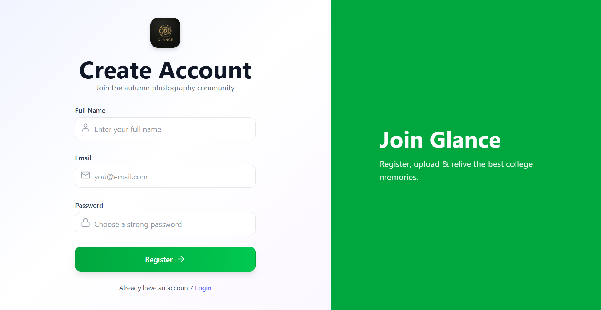
- **OTP Verification**: 
  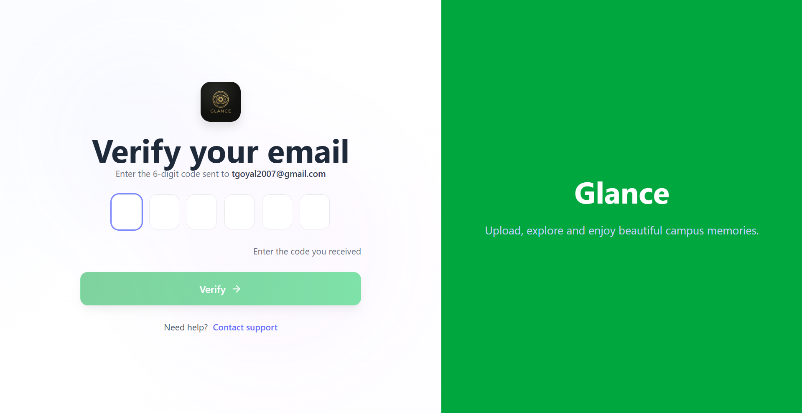
- **Login**: Users can log in using their credentials or via Omniport. 
  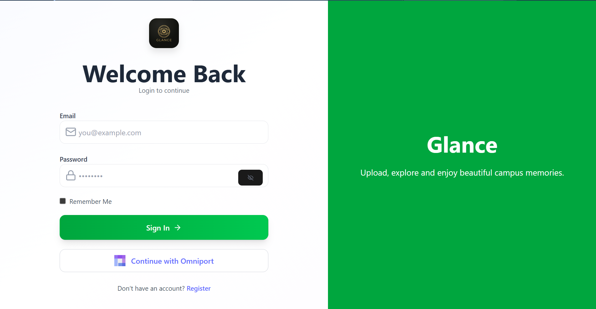

### Step 2: Discovering Events
Once authenticated, users arrive at the **Events** page. This is the central hub to explore all upcoming and past events.
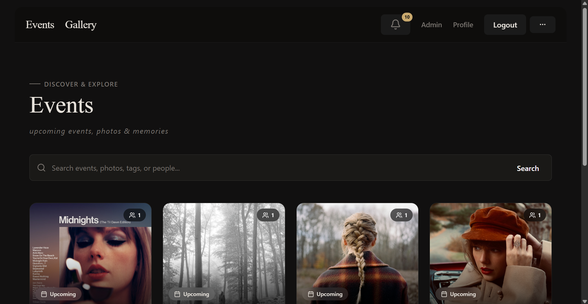

### Step 3: Viewing an Event & Photos
Clicking on an event takes the user to the **Event Gallery**, where they can view all photos associated with that event in a beautiful masonry grid.
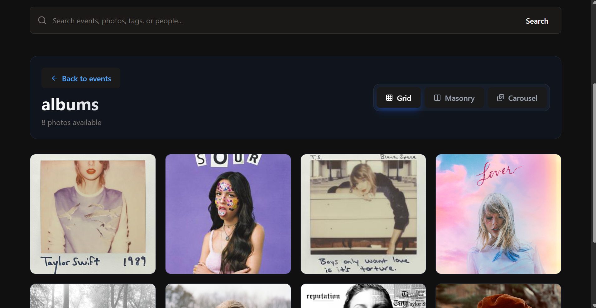

Clicking on any photo opens the immersive **Photo Modal**, providing a high-resolution view where users can see AI tags, and can like or favorite the photo.
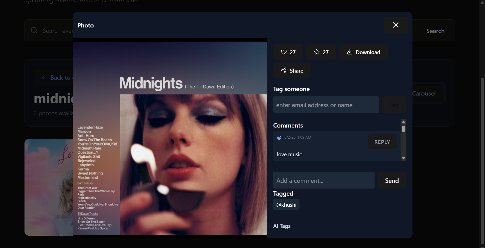

### Step 4: Global Gallery & Powerful Search
The **Global Gallery** aggregates all photos across all events in one seamless experience.
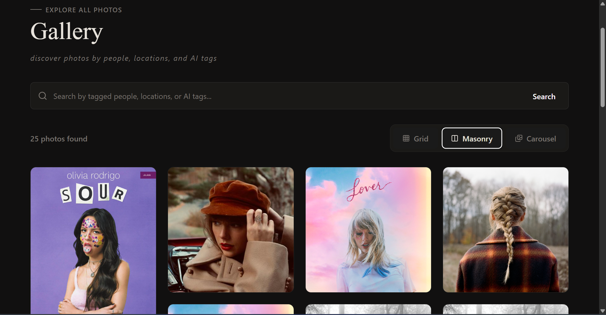

Users can utilize the powerful **Search** functionality to instantly find photos by AI-generated tags (e.g., "crowd", "stage") or by specific people tagged in them.
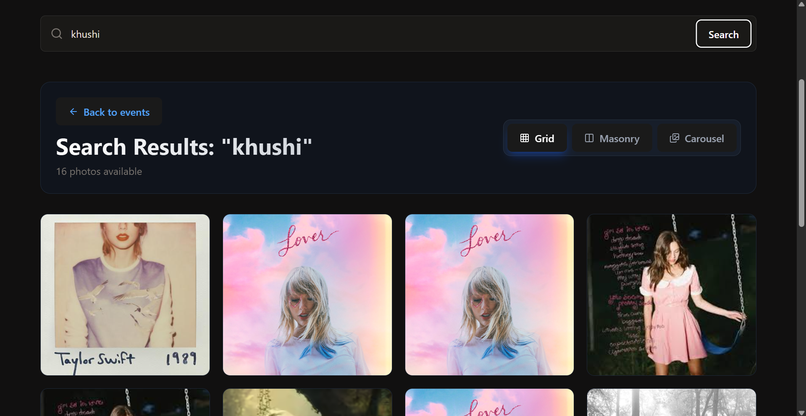

### Step 5: Real-Time Notifications
Users receive instant WebSocket-based notifications when they are tagged in a photo or when event details change. The notification dropdown is elegantly paginated.
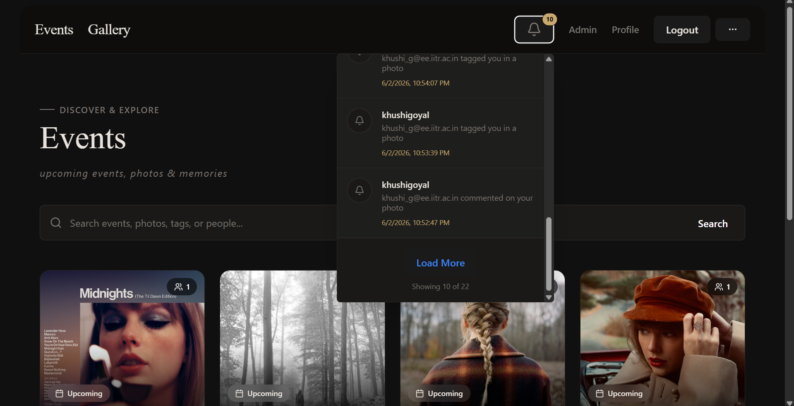

### Step 6: User Profile
The **Profile Page** provides users with an elegant overview of their account details, along with quick access to their liked photos, favorited photos, and photos they have been tagged in.
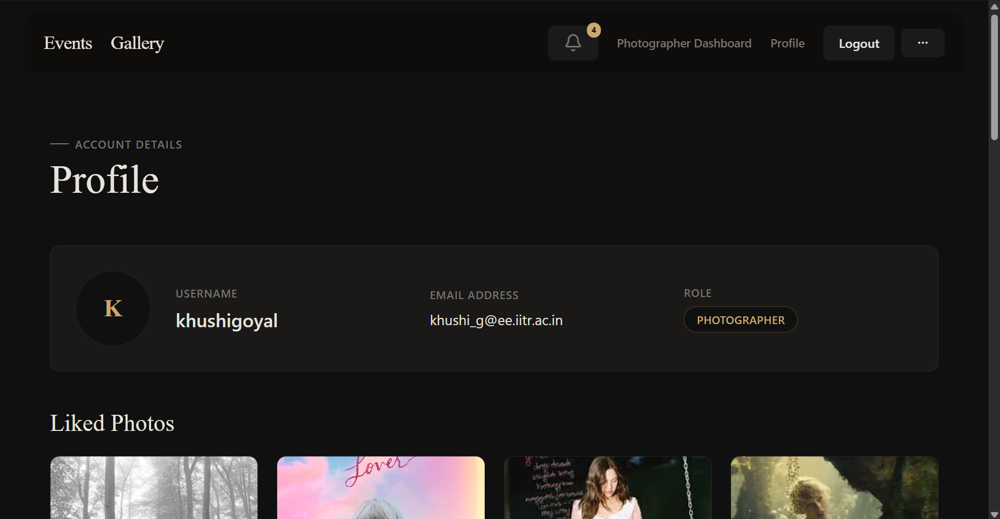

### Step 7: Photographer Dashboard
Photographers have a dedicated **Photographer Dashboard** to easily manage their assignments and perform high-speed bulk photo uploads to specific events.
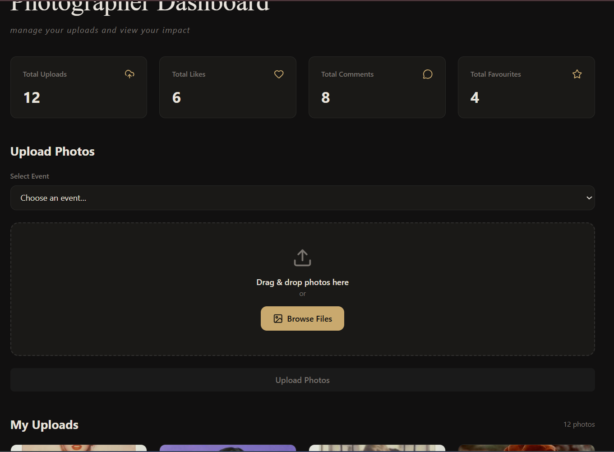

### Step 8: Admin Panel & Event Management
Administrators and Coordinators have access to the **Admin Panel** to manage the platform, user roles, and oversee all events.
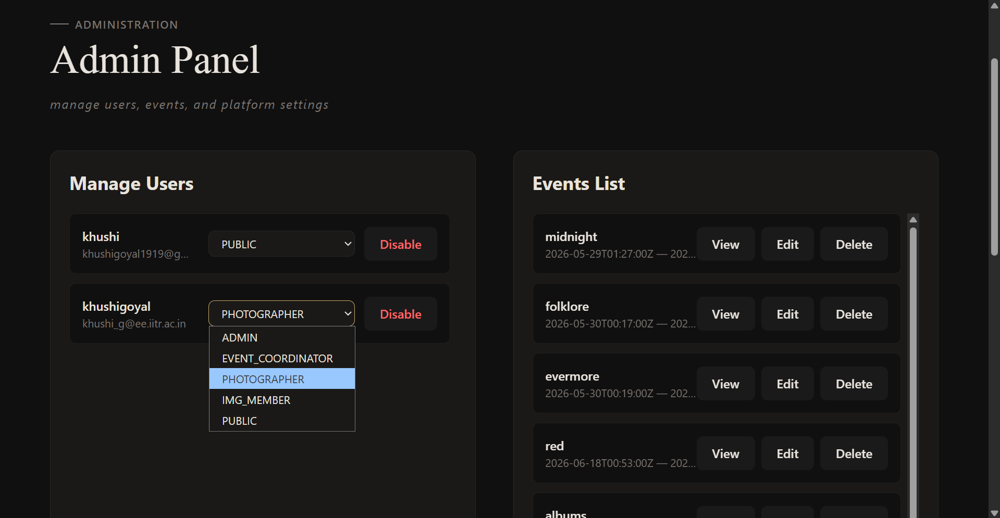

From here, they can seamlessly create new events or edit existing ones.
- **Create Event**: 
  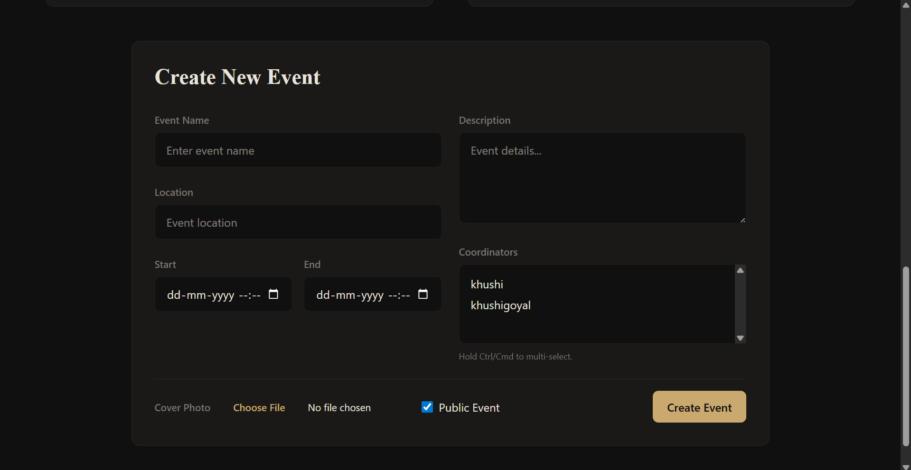
- **Edit Event**: 
  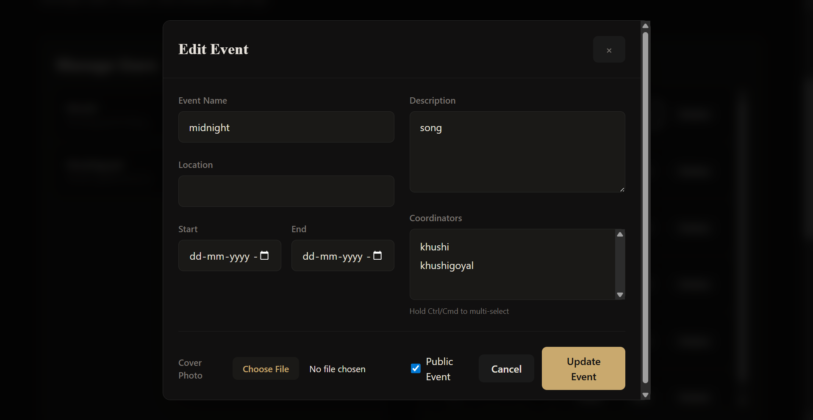

---

## 🛠 Technology Stack

### Backend
- **Framework**: Django 6.0
- **API**: Django REST Framework (DRF)
- **Authentication**: djangorestframework-simplejwt, Omniport OAuth2 integration
- **WebSockets**: Django Channels with Redis
- **Async Tasks**: Celery with Redis broker
- **Database**: SQLite (development), PostgreSQL-ready
- **Image Processing**: Pillow (thumbnails, watermarks, EXIF data)
- **CORS**: django-cors-headers

### Frontend
- **Framework**: React 18 with TypeScript
- **Build Tool**: Vite
- **Styling**: Tailwind CSS
- **State Management**: Redux Toolkit
- **HTTP Client**: Axios with interceptors
- **Icons**: Lucide React
- **Routing**: React Router v6

### Infrastructure
- **Cache & Message Broker**: Redis
- **Task Queue**: Celery
- **WebSocket Layer**: Channels with Redis channel layer

---

## 🏗 Architecture

```
┌─────────────────┐
│  React Frontend │
│   (Vite + TS)   │
└────────┬────────┘
         │
         │ HTTP/WebSocket
         │
┌────────▼────────────────────────┐
│      Django Backend             │
│  ┌──────────────────────────┐  │
│  │   REST API (DRF)         │  │
│  ├──────────────────────────┤  │
│  │   WebSocket (Channels)   │  │
│  ├──────────────────────────┤  │
│  │   Celery Tasks           │  │
│  └──────────────────────────┘  │
└────────┬────────────────────────┘
         │
    ┌────┴────┐
    │  Redis  │  (Cache + Message Broker)
    └─────────┘
```

---

## 📦 Prerequisites

### System Requirements
- Python 3.10+
- Node.js 18+
- Redis Server
- Git

---

## 🚀 Installation & Setup

### 1. Clone the Repository
```bash
git clone <repository-url>
cd <project-folder>
```

### 2. Backend Setup
**Create Virtual Environment**:
```bash
python -m venv myenv
myenv\Scripts\activate  # Windows
# or
source myenv/bin/activate  # Linux/Mac
```

**Install Dependencies**:
```bash
cd autumn_photo_backend
pip install -r requirements.txt
```

**Configure Environment Variables**:
Create `.env` file in `autumn_photo_backend/`:
```env
SECRET_KEY=your-secret-key
DEBUG=True
ALLOWED_HOSTS=localhost,127.0.0.1

# Omniport OAuth Settings
OMNIPORT_BASE_URL=https://channeli.in
OMNIPORT_CLIENT_ID=your-client-id
OMNIPORT_CLIENT_SECRET=your-client-secret
OMNIPORT_REDIRECT_URI=http://localhost:5173/auth/callback

# Redis
REDIS_HOST=localhost
REDIS_PORT=6379

# CORS
CORS_ALLOWED_ORIGINS=http://localhost:5173
```

**Run Migrations & Create Superuser**:
```bash
python manage.py migrate
python manage.py createsuperuser
```

### 3. Frontend Setup
```bash
cd ../frontend/autumn_photo_frontend
npm install
```

**Configure API Base URL**:
Update `src/services/axiosinstances.ts` if needed (Default is `http://localhost:8000/api`).

### 4. Redis Setup
- **Windows**: Run `redis-server.exe` (Download from Microsoft Archive)
- **Linux/Mac**: Run `redis-server`

---

## 🎮 Running the Application

To run the full stack locally, you need to start 4 separate terminal processes:

#### Terminal 1: Django Server
```bash
cd autumn_photo_backend
python manage.py runserver
```
*(Runs on: `http://localhost:8000`)*

#### Terminal 2: Celery Worker
```bash
cd autumn_photo_backend
celery -A autumn_photo worker --loglevel=info --pool=solo
```

#### Terminal 3: Redis Server
```bash
redis-server.exe  # Windows
# or
redis-server      # Linux/Mac
```

#### Terminal 4: Frontend Dev Server
```bash
cd frontend/autumn_photo_frontend
npm run dev
```
*(Runs on: `http://localhost:5173`)*

---

## 📁 Project Structure

```text
django/
├── autumn_photo_backend/          # Django Backend
│   ├── manage.py
│   ├── autumn_photo/              # Main settings (urls, celery, wsgi)
│   ├── accounts/                  # User management & OAuth
│   ├── events/                    # Event CRUD APIs
│   ├── photos/                    # Photo uploads, tagging, image processing tasks
│   ├── notifications/             # WebSockets (Channels)
│   ├── adminpanel/                # Admin views
│   └── dashboard/                 # Analytics & Dashboard views
├── frontend/
│   └── autumn_photo_frontend/     # React Frontend
│       ├── src/
│       │   ├── app/               # Redux store & global layout components (Navbar)
│       │   ├── components/        # Reusable UI components
│       │   ├── pages/             # Page views (events, admin, etc.)
│       │   └── services/          # API Axios clients
└── README.md
```

---

## 🔌 API Endpoints

### Authentication
- `POST /api/auth/login/` - Login with credentials
- `GET /api/auth/omniport/` - OAuth redirect URL
- `POST /api/auth/omniport/callback/` - OAuth callback

### Events & Photos
- `GET /api/events/` - List events (with search capabilities)
- `POST /api/events/` - Create event (Admin/Coordinator)
- `GET /api/events/:id/photos/` - Retrieve photos for an event
- `POST /api/events/:id/upload/` - Bulk upload photos

### Advanced Search & Notifications
- `GET /api/photos/search/` - Search photos by AI tags or people
- `WebSocket /ws/notifications/` - Subscribe to real-time notification events

---

## 👥 User Roles & Permissions

| Role                  | Permissions                                        |
| --------------------- | -------------------------------------------------- |
| **ADMIN**             | Full access: manage users, all events, all photos  |
| **EVENT_COORDINATOR** | Create events, edit assigned events, upload photos |
| **PHOTOGRAPHER**      | Upload photos to assigned events                   |
| **IMG_MEMBER**        | View all events, view all photos                   |
| **PUBLIC**            | View public events only                            |

---

## 🔐 Security & Extensibility

- **Authentication**: JWT-based authentication with auto-refresh mechanism.
- **RBAC**: Strict role-based access control protecting all sensitive APIs.
- **Image Pipeline**: Celery handles heavy image processing (generating optimized thumbnails and large displays) asynchronously without blocking the web server.

---

## 🤝 Contributing

1. Fork the repository
2. Create a feature branch (`git checkout -b feature/AmazingFeature`)
3. Commit changes (`git commit -m 'Add AmazingFeature'`)
4. Push to branch (`git push origin feature/AmazingFeature`)
5. Open a Pull Request

---

## 👨‍💻 Developer
Developed as part of the IMG Autumn Assignment 2025/26
